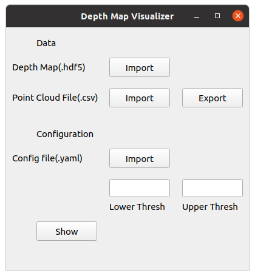
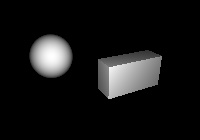
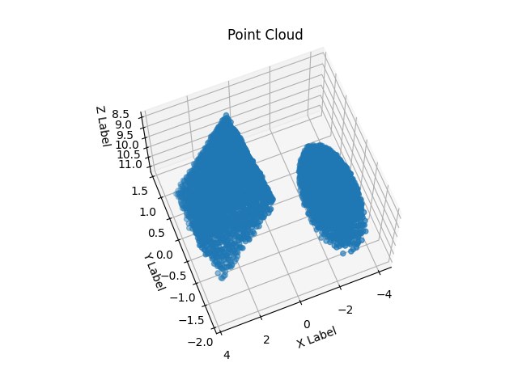

# PointCloud-Visualizer

This project is based on converting the depth map into point cloud and visualizing X-Y-Z point cloud coordinates in 3D scatterplot. User interface is look like as below:



Procedure:
- Import depth map file(.hdf5) with the help of file dialog window
- Import point cloud file(.csv) with the help of file dialog window
- Import configuration file(.yaml) with the help of file dialog window
- Show button creates an 3D scatter graph if the files are chosen

Notes on running:
- Configuration file includes upper and lower thresholds of Z-axis
- Threshold values are shown in text boxes immediately right after configuration file is chosen
- Values in text boxes are not editable, threshold values can be changed only in configuration(.yaml) file
- Export button exports the thresholded Z-axis point cloud coordinates into a file which saves as  ```u(upper_threshold value)l(upper_threshold value).csv```  under pcl_files directory
- ```pcl_files/point_cloud_xyz.csv```  file includes each and every point of depth map


## Installation and Running

Install the required packages with command below:

```sh
pip install -r requirements.txt
```

and run the user interface.

```sh
python ui.py
```

## Image by Intensity Values of the Model File



## Point Cloud Values of the Model File



## TO-DO

- User interface needs to be improved
- UI elements inside docker container needs to be improved
- Automating software deployment such as Kubernetes can be used for deployment of dockerized container